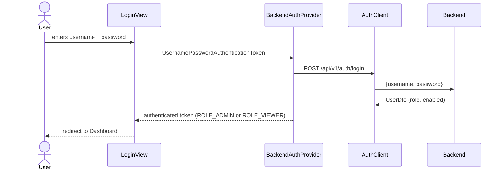
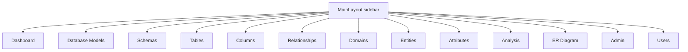

# DBDaDi Frontend -- dbdadi-frontend

## Project Overview

| Property    | Value                                              |
|-------------|----------------------------------------------------|
| Artifact    | it.brunasti:dbdadi-frontend:0.1.0-SNAPSHOT         |
| Type        | Vaadin 24 web application (Spring Boot embedded)   |
| Java        | 21                                                 |
| Spring Boot | 3.4.0                                              |
| Vaadin      | 24.5.0                                             |
| Build tool  | Maven                                              |
| Port        | 8081                                               |
| Backend URL | http://localhost:8080 (configurable)               |

The frontend is a Vaadin Flow single-page application. It communicates with the DBDaDi backend
exclusively through typed REST client beans (`RestClient`). Authentication is handled in the
frontend layer: users log in via a Vaadin `LoginForm`, credentials are validated against the
backend `/api/v1/auth/login` endpoint, and the resulting Spring Security session governs access
to all views.

---

## Project Structure

```
dbdadi-frontend/
+-- pom.xml
+-- src/
    +-- main/
    |   +-- java/it/brunasti/dbdadi/frontend/
    |   |   +-- DbdadiFrontendApplication.java  Main entry point
    |   |   +-- AppShell.java                   Vaadin PWA / viewport config
    |   |   +-- config/
    |   |   |   +-- RestClientConfig.java       Configures shared RestClient bean
    |   |   +-- security/
    |   |   |   +-- SecurityConfig.java         Vaadin + Spring Security integration
    |   |   |   +-- BackendAuthenticationProvider.java  Delegates auth to backend
    |   |   |   +-- SecurityUtils.java          Helper: isLoggedIn(), canEdit()
    |   |   +-- client/                         One bean per backend resource
    |   |   |   +-- AlignmentClient.java
    |   |   |   +-- AnalysisClient.java
    |   |   |   +-- AttributeDefinitionClient.java
    |   |   |   +-- AuthClient.java
    |   |   |   +-- ColumnDefinitionClient.java
    |   |   |   +-- DatabaseModelClient.java
    |   |   |   +-- DomainDefinitionClient.java
    |   |   |   +-- EntityDefinitionClient.java
    |   |   |   +-- ErDiagramClient.java
    |   |   |   +-- ExcelExportClient.java
    |   |   |   +-- ExcelImportClient.java
    |   |   |   +-- JdbcImportClient.java
    |   |   |   +-- RelationshipDefinitionClient.java
    |   |   |   +-- ResetClient.java
    |   |   |   +-- SchemaDefinitionClient.java
    |   |   |   +-- TableDefinitionClient.java
    |   |   |   +-- UserManagementClient.java
    |   |   +-- dto/                            Mirrors backend DTOs (no shared library)
    |   |   +-- views/                          Vaadin views (one class per page)
    |   |   |   +-- MainLayout.java             AppLayout with sidebar navigation
    |   |   |   +-- LoginView.java              Vaadin LoginForm
    |   |   |   +-- DashboardView.java          Route: ""
    |   |   |   +-- DatabaseModelView.java      Route: "database-models"
    |   |   |   +-- DatabaseModelDetailView.java Route: "database-models/:modelId"
    |   |   |   +-- SchemaDefinitionView.java   Route: "schemas"
    |   |   |   +-- SchemaDefinitionDetailView.java
    |   |   |   +-- TableDefinitionView.java    Route: "tables"
    |   |   |   +-- TableDefinitionDetailView.java
    |   |   |   +-- ColumnDefinitionView.java   Route: "columns"
    |   |   |   +-- ColumnDefinitionDetailView.java
    |   |   |   +-- RelationshipDefinitionView.java
    |   |   |   +-- RelationshipDefinitionDetailView.java
    |   |   |   +-- DomainDefinitionView.java   Route: "domains"
    |   |   |   +-- DomainDefinitionDetailView.java
    |   |   |   +-- EntityDefinitionView.java   Route: "entities"
    |   |   |   +-- EntityDefinitionDetailView.java
    |   |   |   +-- AttributeDefinitionView.java Route: "attributes"
    |   |   |   +-- AttributeDefinitionDetailView.java
    |   |   |   +-- AnalysisView.java           Route: "analysis"
    |   |   |   +-- ErDiagramView.java          Route: "er-diagram"
    |   |   |   +-- AdminView.java              Route: "admin"
    |   |   |   +-- UserManagementView.java     Route: "users"
    |   +-- resources/
    |       +-- application.properties          Port 8081, backend URL, Vaadin settings
    +-- test/
        +-- java/it/brunasti/dbdadi/frontend/
            +-- DbdadiFrontendApplicationTests.java  Context load smoke test
```

---

## Main Entry Point

```java
// DbdadiFrontendApplication.java
@SpringBootApplication
public class DbdadiFrontendApplication {
    public static void main(String[] args) {
        SpringApplication.run(DbdadiFrontendApplication.class, args);
    }
}
```

`AppShell` configures Vaadin PWA metadata and the mobile viewport. No data initialisation
occurs on the frontend side -- all state lives in the backend.

---

## Key Configuration Files

### application.properties

```properties
spring.application.name=dbdadi-frontend
server.port=8081
dbdadi.api.base-url=http://localhost:8080
vaadin.launch-browser=true
```

### RestClientConfig

```java
@Bean
public RestClient restClient(@Value("${dbdadi.api.base-url}") String baseUrl) {
    return RestClient.builder()
            .baseUrl(baseUrl)
            .defaultHeader("Content-Type", "application/json")
            .defaultHeader("Accept", "application/json")
            .build();
}
```

A single shared `RestClient` bean is injected into every `*Client` class. The base URL is
read from `dbdadi.api.base-url` so it can be overridden per environment.

---

## Authentication and Security



- `SecurityConfig` extends `VaadinWebSecurity` and points the login view at `LoginView`.
- `BackendAuthenticationProvider` translates credentials to a `UserDto` by calling the backend
  and builds a Spring `Authentication` token with `ROLE_ADMIN` or `ROLE_VIEWER`.
- `SecurityUtils.canEdit()` returns `true` when the current user holds `ROLE_ADMIN`.
  Edit/delete buttons and dialogs are hidden from `ROLE_VIEWER` users.

---

## Navigation Structure



Sidebar sections (separated by dividers in the UI):

1. Dashboard
2. Database Models
3. Schemas / Tables / Columns / Relationships (physical layer)
4. Domains / Entities / Attributes (logical layer)
5. Analysis / ER Diagram
6. Admin / Users

---

## View Descriptions

| View                         | Route                              | Key features                                                             |
|------------------------------|------------------------------------|--------------------------------------------------------------------------|
| DashboardView                | (root)                             | Summary counts per resource                                              |
| DatabaseModelDetailView      | database-models/:modelId           | JDBC import, alignment check, ER diagram, linked domains                 |
| SchemaDefinitionDetailView   | schemas/:schemaId                  | Tables list, schema-level ER diagram button                              |
| TableDefinitionDetailView    | tables/:tableId                    | Columns grid (with attribute), relationships, edit entity link, row count|
| ColumnDefinitionView         | columns                            | Global list with DB Model/Schema/Table/Attribute/Position filters        |
| ColumnDefinitionDetailView   | columns/:columnId                  | Full column metadata, attribute link                                     |
| DomainDefinitionDetailView   | domains/:domainId                  | Linked entities, linked DB models, bulk-create entities button           |
| EntityDefinitionDetailView   | entities/:entityId                 | Attributes, tables, domains, merge into, generate from columns           |
| AttributeDefinitionDetailView| attributes/:attributeId            | Linked columns, edit/delete, suggest entity, merge into                  |
| AnalysisView                 | analysis                           | Run cross-model analysis, review and apply entity/attribute suggestions  |
| ErDiagramView                | er-diagram                         | Domain selector, display PlantUML source                                 |
| AdminView                    | admin                              | Excel import/export, database reset buttons                              |
| UserManagementView           | users                              | CRUD for user accounts (ADMIN only)                                      |

---

## Client Layer

Each client class wraps one backend resource. They all take the shared `RestClient` bean
via constructor injection (`@RequiredArgsConstructor`).

### Pattern

```java
@Component
@RequiredArgsConstructor
public class ExampleClient {

    private static final String BASE_PATH = "/api/v1/examples";
    private final RestClient restClient;

    public List<ExampleDto> findAll() {
        return restClient.get().uri(BASE_PATH)
                .retrieve().body(new ParameterizedTypeReference<>() {});
    }

    public ExampleDto findById(Long id) {
        return restClient.get().uri(BASE_PATH + "/{id}", id)
                .retrieve().body(ExampleDto.class);
    }
}
```

### Client Inventory

| Client                    | Backend base path             | Notable methods                                          |
|---------------------------|-------------------------------|----------------------------------------------------------|
| AuthClient                | /api/v1/auth                  | login(username, password)                                |
| DatabaseModelClient       | /api/v1/database-models       | findAll, findById, create, update, delete                |
| SchemaDefinitionClient    | /api/v1/schemas               | findAll, findByDatabaseModel, findById, ...              |
| TableDefinitionClient     | /api/v1/tables                | findAll, findBySchema, findById, findAll (list)          |
| ColumnDefinitionClient    | /api/v1/columns               | findAll, findByTable, findBySchema, findByDatabaseModel  |
| RelationshipDefinitionClient | /api/v1/relationships      | findByFromTable, findByToTable                           |
| DomainDefinitionClient    | /api/v1/domains               | findAll, findByDatabaseModel, findDatabaseModels, setDatabaseModels |
| EntityDefinitionClient    | /api/v1/entities              | bulkCreate, merge, generateAttributes                    |
| AttributeDefinitionClient | /api/v1/attributes            | findByEntity, merge, suggestEntities                     |
| AlignmentClient           | /api/v1/alignment             | check(databaseModelId, password)                         |
| AnalysisClient            | /api/v1/analysis              | run(), apply(request)                                    |
| ErDiagramClient           | /api/v1/er-diagram            | generate(domainId), generateSchema(schemaId)             |
| JdbcImportClient          | /api/v1/import                | importJdbc(request)                                      |
| ExcelImportClient         | /api/v1/admin/import          | importExcel(file)                                        |
| ExcelExportClient         | /api/v1/admin/export          | exportExcel() -> byte[]                                  |
| ResetClient               | /api/v1/admin/reset           | resetDatabase(), resetModeling()                         |
| UserManagementClient      | /api/v1/users                 | findAll, create, update, delete                          |

---

## DTO Layer

The frontend maintains its own copy of every DTO (package `it.brunasti.dbdadi.frontend.dto`).
There is no shared library between backend and frontend -- this is intentional to keep
the two modules independently deployable.

| DTO                       | Purpose                                                        |
|---------------------------|----------------------------------------------------------------|
| DatabaseModelDto          | Model metadata + jdbcUrl, dbType                               |
| SchemaDefinitionDto       | Schema + databaseModelName                                     |
| TableDefinitionDto        | Table + schemaName, databaseModelName, entityId/Name, rowCount |
| ColumnDefinitionDto       | Column + tableName, schemaName, attributeId/Name               |
| EntityDefinitionDto       | Entity name + description                                      |
| AttributeDefinitionDto    | Attribute + entityId/Name                                      |
| DomainDefinitionDto       | Domain name + description                                      |
| AlignmentRequest/Result   | Password + structured diff (list of AlignmentItem)             |
| AlignmentItem             | schemaName, tableName, columnName, status (ADDED/REMOVED/CHANGED) |
| AnalysisResult            | Lists of AnalysisEntitySuggestion + AnalysisAttributeSuggestion|
| BulkEntityRequest/Result  | databaseModelIds + domainId / counts + warnings                |
| MergeEntityRequest/Result | sourceEntityId + targetEntityId / migrated counts + warnings   |
| MergeAttributeRequest/Result | sourceAttributeId + targetAttributeId / columnsMigrated     |
| AttributeEntitySuggestion | entityId/Name, viaTableNames, linkedColumnsCount               |
| GenerateAttributesResult  | attributesCreated, columnsLinked, columnsAlreadyLinked          |

---

## Notable Patterns and Architecture Decisions

**Stateless view pattern.** Each detail view stores the loaded DTO as a field (`entity`,
`attribute`, etc.). `beforeEnter()` loads fresh data from the backend on every navigation.
`populateFields()` calls `removeAll()` and rebuilds the layout so that the view is always
in sync with the current DTO state.

**Editor visibility gating.** All edit/delete/action buttons check `SecurityUtils.canEdit()`
at render time. `ROLE_VIEWER` users see a fully read-only UI.

**ConfirmDialog before destructive actions.** All delete and merge operations show a Vaadin
`ConfirmDialog` with a warning message before executing. The confirm button theme is set to
`"error primary"` so it renders in red.

**Two-level navigation.** List views (e.g. `DatabaseModelView`) show all items in a `Grid`.
Clicking a row (or a link button) navigates to the corresponding detail view using
`UI.getCurrent().navigate("resource/" + id)`. Breadcrumb buttons in detail views navigate back.

**Cascading filter pattern.** The global Columns list (`ColumnDefinitionView`) has three
cascading `ComboBox` filters (Database Model -> Schema -> Table). Each level clears and
re-populates the next, then calls `refresh()` which loads the appropriate subset.

**Client error handling.** Every backend call is wrapped in a try/catch. Errors surface as
a Vaadin `Notification` with `NotificationVariant.LUMO_ERROR` (red) or `LUMO_SUCCESS` (green).
The raw exception message is included so users can see what went wrong.

**No shared module.** The backend and frontend are separate Maven projects with no parent POM.
DTOs are duplicated by design to keep deployments independent.

---

## Key Dependencies

| Dependency                        | Version  | Purpose                                |
|-----------------------------------|----------|----------------------------------------|
| vaadin-spring-boot-starter        | 24.5.0   | Vaadin Flow + Spring integration       |
| spring-boot-starter-web           | 3.4.0    | RestClient HTTP calls to backend       |
| spring-boot-starter-security      | 3.4.0    | Session management + login flow        |
| lombok                            | (managed) | Boilerplate reduction                 |
| vaadin-maven-plugin               | 24.5.0   | Frontend asset compilation             |

---

## Build Commands

```bash
# Compile only
mvn compile

# Run tests
mvn test

# Package (includes Vaadin frontend bundle)
mvn package

# Run in development mode (hot reload, no bundle needed)
mvn spring-boot:run

# Production build (compiles and bundles Vaadin assets)
mvn package -Pproduction

# Skip tests during build
mvn package -DskipTests
```

In development mode Vaadin serves assets directly from the classpath without a production
bundle. The `vaadin-maven-plugin prepare-frontend` goal runs automatically during `compile`
to ensure npm dependencies are in place.

---

## Configuration Properties Reference

| Property                  | Default                    | Description                               |
|---------------------------|----------------------------|-------------------------------------------|
| server.port               | 8081                       | HTTP port for the frontend                |
| dbdadi.api.base-url       | http://localhost:8080      | Backend REST API base URL                 |
| vaadin.launch-browser     | true                       | Auto-opens browser on startup             |

---

## Testing Structure

```
src/test/java/it/brunasti/dbdadi/frontend/
+-- DbdadiFrontendApplicationTests.java    Spring context load smoke test
```

The test suite is minimal (context load only). Because the application requires a running
backend to authenticate, integration tests would need a mock `AuthClient` or a test profile
with a mock server.

---

## Deployment Notes

Both modules must run simultaneously. Typical local setup:

1. Start the backend: `cd db-data-dictionary && mvn spring-boot:run -Dspring-boot.run.profiles=postgres`
2. Start the frontend: `cd dbdadi-frontend && mvn spring-boot:run`
3. Open `http://localhost:8081` in a browser
4. Log in as `admin / admin` (change on first use)

For production, build each module with `mvn package -Pproduction -DskipTests` and run the
resulting JAR with the appropriate environment variables for datasource URL, credentials,
and `dbdadi.api.base-url`.
